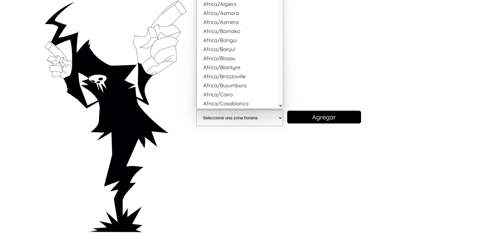
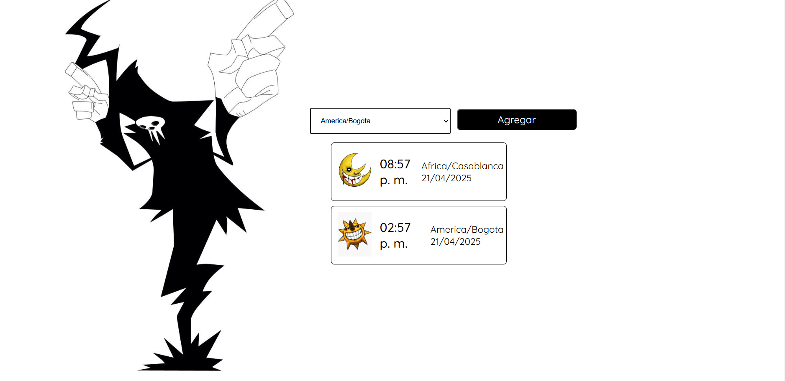

# Reloj- Mundial
Este proyecto obtiene la hora y fecha de una zona horaria especifica. Cuenta con una interfaz minimalista, inspirada en el anime Soul Eater. Funciona   mediante una API que consulta  todas las zonas horarias  disponibles y las muestra en un elemento select. Al elegir una zona, se realiza una segunda petición a la API para obtener la hora y la fecha correspondientes. 

---

## Objetivo

Comprender el funcionamiento de las APIs y aplicar estos conocimientos en un proyecto practico.

---

## Tecnologías Utilizadas

- HTML
- CSS
- Java Script
- Git
- GitHub
- TimeAPI (API para obtener información horaria)

---

## Componentes Principales

- **Slice var:** contiene dos imagenes inspiradas en Soul Eater que se alternan  mediante una función en JavaScript.
- **Select:** lista desplegable con todas las zonas horarias proporcionadas por **TimeApi.**
- **Boton:**   activa las funciones principales, incluyendo validaciones y peticiones a la API.
- **Card:** muestra el resultado de la consulta a la API. Contiene un icono (sol  o luna) , la hora , Zona horaria y la fecha. La hora se  actualiza de manera automáticamente.

---

## Captura de pantalla

---

